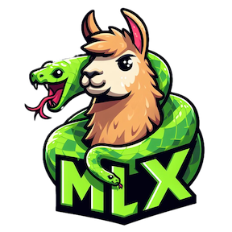

# PyOMlx
### Serve MlX models locally!

## Motivation
Inspired by [Ollama](https://github.com/ollama/ollama) project, I wanted to have a similar experience for serving [MLX models](https://github.com/ml-explore/mlx-examples). [Mlx from ml-explore](https://github.com/ml-explore/mlx) is a new framework for running ML models in Apple Silicon. This app is intended to be used along with [PyOllaMx](https://github.com/kspviswa/pyOllaMx)

I'm using these in my day to day workflow and I intend to keep develop these for my use and benifit.

If you find this valuable, feel free to use it and contribute to this project as well. Please ⭐️ this repo to show your support and make my day!

I'm planning on work on next items on this [roadmap.md](roadmap.md). Feel free to comment your thoughts (if any) and influence my work (if interested)

MacOS DMGs are available in [Releases](https://github.com/kspviswa/PyOMlx/releases) page

## How to use

1) [Download](https://github.com/kspviswa/PyOMlx/releases) & Install the PyOMlx MacOS App

2) Clean up old installation if exists

```bash
rm -rf ~/.pyomlx
```

3) Run the app

4) You will now see the application running in the system tray. Use [PyOllaMx](https://github.com/kspviswa/pyOllaMx) to chat with MLX models seamlessly

## Features

### [v0.1.1](https://github.com/kspviswa/PyOMlx/releases/tag/0.1.1)
- Revamped the http server portion to use the `mlx_lm.server` module. As of the latest version (`v0.20.5`) the module accepts dynamic model information from the incoming request. Hence this can be better utilized by PyOMlx. Also the `load()` function supports automatic model download from HF if not available in local `~/.cache `directory. This replaces the `/download` endpoint.
- Finally, since `mlx_lm.server` runs a `httpd`, there is no need for external `flask`. So I got rid of that too. Resulting PyOMlx binary is very slim (~100 MB) and much much faster.
- Rest everything is same as [v0.1.0](https://github.com/kspviswa/PyOMlx/releases/tag/0.1.0)


### [v0.1.0](https://github.com/kspviswa/PyOMlx/releases/tag/0.1.0)
- Added OpenAI API Compatible [chat completions](https://platform.openai.com/docs/api-reference/chat/create) and [list models](https://platform.openai.com/docs/api-reference/models/list) endpoint.
- Added `/download` endpoint to download MLX models directly from HuggingFace Hub. All models will be downloaded from [MLX Community](https://huggingface.co/mlx-community) in HF Hub.
- Added `/swagger.json` endpoint to serve OpenAPI Spec of all endpoints available with PyOMlx.

Now you simply use any standard OpenAI Client to interact with your MLX models easily. More info on the [v0.1.0 release](https://github.com/kspviswa/PyOMlx/releases/tag/0.1.0) page.

### [v0.0.3](https://github.com/kspviswa/PyOMlx/releases/tag/0.0.3)
- Updated `mlx-lm` to support Gemma models

### [v0.0.1](https://github.com/kspviswa/PyOMlx/releases/tag/0.0.1)
- Automatically discover & serve MLX models that are downloaded from [MLX Huggingface community](https://huggingface.co/mlx-community).
- Easy start-up / shutdown via MacOS App
- System tray indication

## Demo

https://github.com/kspviswa/pyOllaMx/assets/7476271/dc686d60-182d-4f90-a771-9c1df1c70b5c